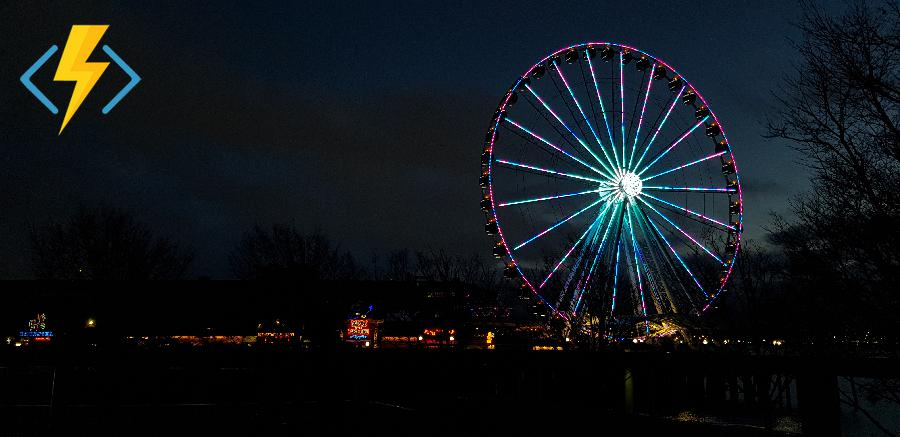

# blob-trigger-watermark-blob-out-binding (Python)

| Sample | Description | Trigger | In Bindings | Out Bindings
| ------------- | ------------- | ------------- | ----------- | ----------- |
| `blob-trigger-watermark-blob-out-binding` | Azure Function Python Sample that watermarks an image. This function triggers on an input blob (image) and adds a watermark by calling into the Pillow library. The resulting composite image is then written back to blob storage using a blob output binding. | Blob Storage | Blob Storage | Blob Storage |

## Sample output


## Configurations
As specified in `functions.json`, you need Azure Storage account for triggering functions, input & output binding.

```json
{
  "scriptFile": "__init__.py",
  "bindings": [
    {
      "name": "blobin",
      "type": "blobTrigger",
      "direction": "in",
      "path": "input/{blobname}.{blobextension}",
      "connection": "MyStorageConnectionString"
    },
    {
      "name": "blobout",
      "type": "blob",
      "direction": "out",
      "path": "output/{blobname}_watermarked.jpg",
      "connection": "MyStorageConnectionString"
    }
  ]
}
```

### Create Azure Storage Account

Create an Azure Storage Account
```sh
RESOURCE_GROUP="rg-testfunctions"
REGION="japaneast"
STORAGE_ACCOUNT="teststore"
az storage account create --name $STORAGE_ACCOUNT \
    --location $REGION \
    --resource-group $RESOURCE_GROUP \
    --sku Standard_LRS
```

### Create Blob Storage Containers

Create 2 blob containers in the storage you've created: `input` and `output`
```sh
# Get Storage Key
ACCESS_KEY=$(az storage account keys list --account-name $STORAGE_ACCOUNT --resource-group $RESOURCE_GROUP --output tsv |head -1 | awk '{print $3}')

az storage container create  \
    --name "input" \
    --account-name $STORAGE_ACCOUNT \
    --account-key $ACCESS_KEY

az storage container create  \
    --name "output" \
    --account-name $STORAGE_ACCOUNT \
    --account-key $ACCESS_KEY
```

## How to develop and publish the functions

### Local development

```sh
func host start
```

### Publish the function to the cloud

Publish the function to the cloud
```sh
FUNCTION_APP_NAME="MyFunctionApp"
func azure functionapp publish $FUNCTION_APP_NAME --build-native-deps --no-bundler
```

Add Functions App Settings
```sh
FUNCTION_STORAGE_CONNECTION="*************"
az webapp config appsettings set \
  -n $FUNCTION_APP_NAME \
  -g $RESOURCE_GROUP \
  --settings \
    MyStorageConnectionString=$FUNCTION_STORAGE_CONNECTION
```

### Try it out
Upload an image to `input` blob container under the storage account to try it out. The final watermarked composite should surface in the `output` container. If you're developing locally it should also render it on screen (works on Mac, Linux, WSL with Xming X server, unsure about Windows).